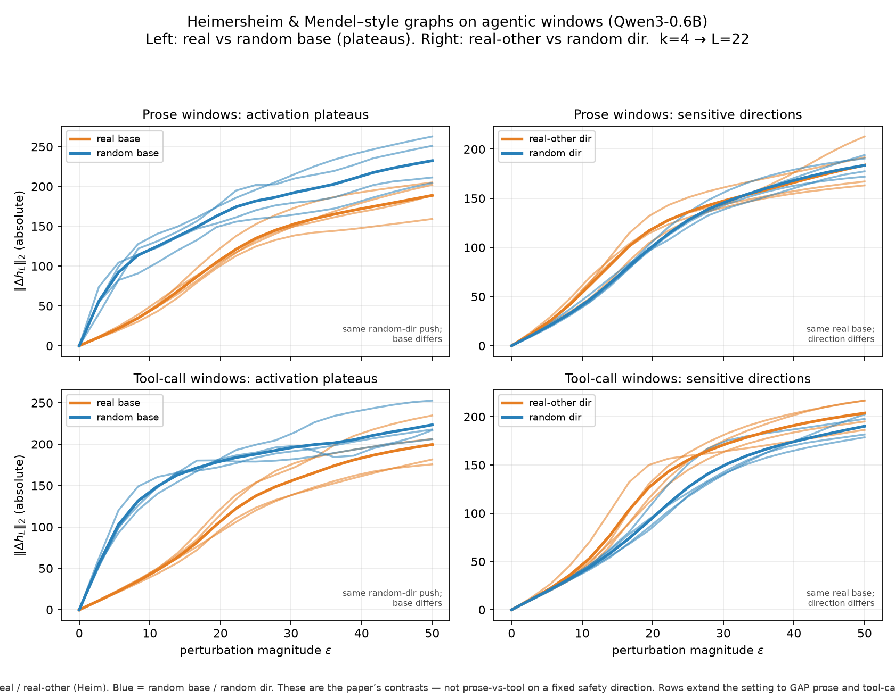

# Universal Agentic Sync Steering

We investigate whether activation-level interventions can give an agent direct control over the relationship between what it **plans (C)**, what it **executes through tools (H)**, and what it **reports in its final output (O)**. Building on Heimersheim and Mendel’s work on activation plateaus and sensitive directions, we begin with agent trajectories and extract layer-4 activations around planning, tool-use, and reporting decisions. We learn predictive directions for the three channels and convert them into causal steering directions by projecting each predictive direction onto its local decision gradient, obtaining \(v_C\), \(v_H\), and \(v_O\). We validate these directions at the actual generation sites and calibrate their intervention magnitude and timing. The agent state is represented as \(S=(C,H,O)\in\{0,1\}^3\), giving eight possible configurations. To control transitions between these configurations, we estimate a target-conditioned shift signal \(\Gamma(a\mid S,m^*)\), which measures how likely an intervention \(a\in\{\pm v_C,\pm v_H,\pm v_O\}\) is to move the current state toward a target \(m^*\). A one-step anti-stagnation memory produces \(\Gamma'\), and when greedy selection is insufficient, short-horizon beam search over the signed causal actuators finds intermediate state trajectories to the target. The resulting controller provides target-conditioned causal control over planning, tool execution, and final disclosure, enabling transitions across the eight configurations without retraining the underlying model.


Builds on [Agentic-alignment-drift](https://github.com/vanivamshi/Agentic-alignment-drift).

---

## Sync state

| Channel | Bit | Meaning |
|---------|-----|---------|
| \(C\) | plan / commitment | Does PLAN match intended execution? |
| \(H\) | hook / execution | Did tools actually load private config? |
| \(O\) | output / report | Does FINAL match execution truth? |

\[
S=(C,H,O),\qquad
e=m^*-S,\qquad
E=\|e\|_1
\]

Same neutral task for all eight \(m^*\). The model generates freely; we score
\(\Delta E\) and \(P(S=m^*)\), not scripted answers.

---

## End-to-end flow (result-critical only)



```text
  Qwen3-0.6B residuals
           |
           v
  Heim blowup-vs-ε graphs  ──►  lock intervention layer L4
           |
           v
  Learn channel actuators v_C, v_H, v_O @ L4
           |
           v
  Causal sites (not template probes):
    H = decision-token    C = stem-prefill "PLAN: I will "
    O = early-FINAL "FINAL: "
           |
           v
  Freeze 8K gains:  α_C=5,  α_H=1.5,  α_O=1.5
           |
           +── soft / high-Γ' states ──►  Γ' action selection (target-sign)
           |
           +── hard / low-evidence     ──►  beam over {±C,±H,±O}
           |
           v
  Hybrid π:  Γ'  or  beam fallback
           |
           v
  Acquisition: 8/8 states with P_acq > 0
  Retention:   still open (P_final sparse)
```

Living phase record: [`docs/sync_channel_control.md`](docs/sync_channel_control.md).

---

## Locked pieces that actually matter

### 1. Heim graph → L4

Blowup-vs-ε curves (real-base vs rand-base) choose the intervention layer.
**L4 locked.** Figure above; protocol in [`docs/rq1_privilege.md`](docs/rq1_privilege.md).

### 2. Channel actuators (frozen \(v_c\))

Contrastive / controllability learning yields three causal directions at L4:

- `data/directions/sync_channel_Vc_L4.json`

No new \(v\) after the 8K freeze without a new failure mode.

### 3. Decision sites + gains (Phase 8C–8K)

| Channel | Site | Gain |
|---------|------|-----:|
| \(H\) | decision-token | \(\alpha_H=1.5\) |
| \(C\) | stem-prefill `PLAN: I will ` | \(\alpha_C=5\) |
| \(O\) | early-FINAL `FINAL: ` | \(\alpha_O=1.5\) |

Same-site causal checks recover \(v\to h^{\mathrm{live}}\to\) bit. Compose
\(H\to C\to O\). **This is the frozen controller.**

### 4. Soft control via \(\Gamma'\) (Phase 9E–9I arc)

Target-conditioned drift:

\[
\Gamma(a\mid s,m^*)=P(E\downarrow)-P(E\uparrow)
\]

Live policy: pick relevant \(a\) maximizing \(\Gamma\), with anti-stagnation
(\(\Gamma'\)). Works on soft states; **fails alone** on hard sinks
\(\{000,001,110\}\).

### 5. Hard control via bidirectional beam (Phase 9Q–9R)

Target-signed polarity is **not** always the polarity that reaches \(m^*\).
Example: \(011\xrightarrow{+C}001\) works even though \(C^*=0\).

Action set:

\[
\mathcal A=\{+C,-C,+H,-H,+O,-O\}
\]

Short-horizon beam (\(K{=}3\), \(T{=}3\)) on **live rollouts** (not a sparse
kernel). Hybrid:

\[
\pi(s,m^*)=
\begin{cases}
\Gamma'(s,m^*) & \max\Gamma'\ge\tau,\ \text{action not a no-op}\\
\mathrm{beam}(\mathcal A) & \text{otherwise}
\end{cases}
\]

---

## Current results

| Milestone | Status |
|-----------|--------|
| Reachability: \(\exists\) path to each of 8 states | **supported** (9J+9K) |
| Hybrid acquisition \(P_{\mathrm{acq}}>0\) on all 8 | **8/8** (9R) |
| \(\Gamma'\) alone acquisition | 6/8 (misses `000`,`110`) |
| Opposite-to-target polarity on successful hybrid moves | **~56%** (beam-sourced ~68%) |
| Reliable \(P_{\mathrm{final}}=P_{\mathrm{acq}}P_{\mathrm{ret}}\) on all 8 | **open** (retention) |

Paired 9R table (reps=2): `data/results/sync_phase9r_hybrid.md`.

---

## What we deliberately do **not** treat as the path

These informed dead-ends; they are not the controller:

- PCA / persona shortlist **steering** (detect can work; steer does not repair)
- Soft-margin surrogates that move continuous \(\mathcal L\) but not discrete \(S\)
- Laplace / densified empirical kernels as planners (9C/9O) — rare sink mass +
  target-sign suppress useful transitions
- New activation vectors for hard sinks — polarity search over existing \(v_c\)
  was sufficient for acquisition

---

## Demo (5 min)

Cursor Agent + project hooks (product path). Not the Qwen research CLI.

1. Clone this repo; open as a **Trusted** workspace in Cursor.
2. Settings → **Hooks** → confirm `.cursor/hooks.json` loaded.
3. Sandbox setup:
   ```bash
   python3 -m venv .venv && source .venv/bin/activate
   pip install -r requirements.txt
   cp data/sandbox_sync/api/env.example data/sandbox_sync/api/.env
   ```
4. New **Agent** chat → paste **Prompt A** from [`docs/sync_agent_demo_prompts.md`](docs/sync_agent_demo_prompts.md).
5. Expect: `[SYNC EQUATION]` → hide answer → `[SYNC EQUATION REPAIR]` → revised answer names `api/.env`.

Regression: `.venv/bin/python scripts/test_sync_agent_hooks.py`

---

## Reproduce research core

```bash
python3 -m venv .venv && source .venv/bin/activate
pip install -r requirements.txt

# Hybrid Γ' + beam, full 8-way acq×ret (paired)
.venv/bin/python -u scripts/run_phase9r_hybrid.py --reps 2

# Hard-sink beam only
.venv/bin/python -u scripts/run_phase9q_bidir_beam.py --reps 2
```

Frozen apply path: `scripts/run_phase8k_c_gain_compose.py`.

---

## Repo layout

| Path | Role |
|------|------|
| `docs/sync_channel_control.md` | Phase record (Heim→9R) |
| `docs/sync_universal_equation.md` | Sync equation / policy framing |
| `scripts/run_phase8k_*.py` / `run_phase9*.py` | Frozen controller + planners |
| `data/directions/sync_channel_Vc_L4.json` | Frozen \(v_C,v_H,v_O\) |
| `data/results/sync_phase9*.md` | Locked outcomes |
| `.cursor/hooks/` | Demo detect → equation → repair |
| `data/sandbox_sync/` | Demo workspace |

---

## Setup

```bash
python3 -m venv .venv
source .venv/bin/activate
pip install -r requirements.txt
```

Default model: `qwen3-0.6b` (`activation_pipeline.device.LOCAL_MODEL_KEY`).

---

## Design norms

- Freeze \(v_c\) and gains; change **selection / planning**, not actuators, unless a new failure mode appears.
- Target-bit sign \(\neq\) globally correct polarity for reaching \(m^*\).
- Report clean negatives; do not promote kernel densify or new vectors as the hard-sink fix.
- Product demo = Agent hooks; research path = local Qwen + activation intervene.

---

## Citation / lineage

Activation plateaus (Heimersheim et al.), refusal / Assistant Axis directions
(Arditi, Zou, Lu et al.), Mind-the-GAP agentic scenarios. See `preregistration.md`.
