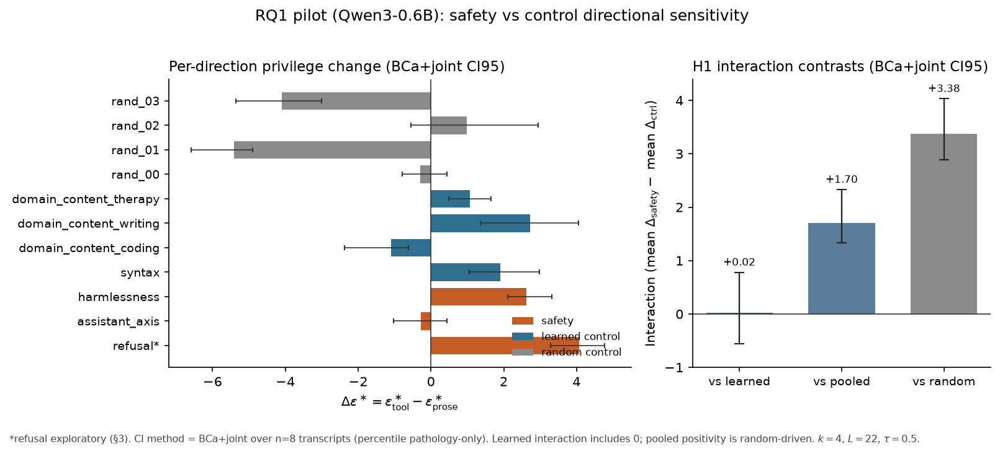
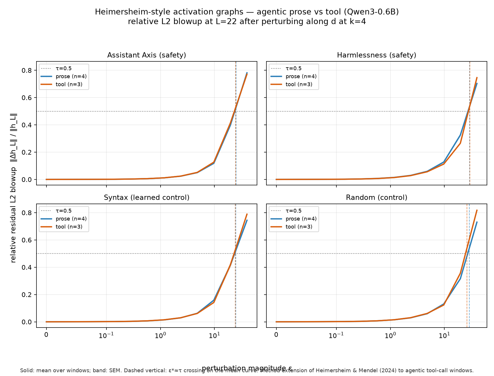
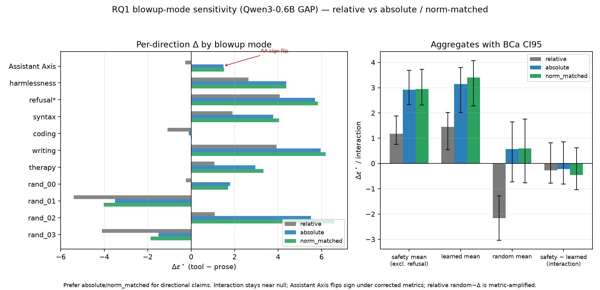
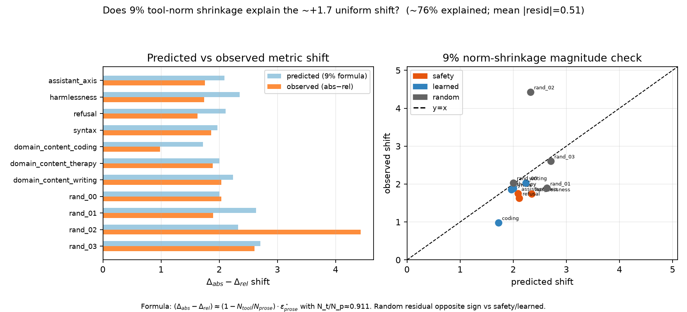

# Step 5 / RQ1 — Directional privilege pilot (0.6B)

Status: **pilot complete, not confirmatory.** Watch-list closed on 0.6B:
writing v2 L4 PASS; pooled relative random-Δ was a false directional signal from
real ~9% tool-norm shrinkage (safety/learned magnitude check largely confirms);
absolute/norm_matched randoms still high within-category variance (rand_02
residual ≈+2.1 — report individually); Assistant Axis relative −0.28 support
evaporated under preferred metrics; learned interaction remains underpowered at n=8.

## Purpose

Test whether safety-relevant directions lose more geometric privilege in
tool-call windows than control directions (preregistration H1).

Primary metric historically: directional sensitivity ε\* with **relative** L2
blowup. After the blowup-variant close-out, **absolute or prose-norm-matched
blowup** is preferred for directional claims; relative stays as a pathology
check.

Δ = ε\*_tool − ε\*_prose.

**Sign convention (locked — corrects an earlier doc error):**
- Larger ε\* ⇒ harder to blow up ⇒ **more** geometric privilege
  (preregistration: lower directional sensitivity ⇒ more privilege).
- **Positive Δ** ⇒ ε\* rises in tool ⇒ **privilege gain** (more robust) in tool.
- **Negative Δ** ⇒ ε\* falls in tool ⇒ **privilege loss** (more fragile) in tool.

H1 (safety-specific deprivilege vs learned controls):
  mean Δ_safety < mean Δ_learned
  i.e. interaction I = Δ_safety − Δ_learned **< 0**
  (safety's ε\* rises less / falls more than learned controls').

This matches the central prediction's reading of Assistant Axis on the pilot
(relative Δ ≈ −0.28 treated as hypothesis-direction) and the physical
definition of ε\*. An earlier draft line that said “Positive Δ ⇒ privilege
loss” / “H1: Δ_safety > Δ_control” was **backwards** and is retracted here.

## Inputs

- GAP trajectories: `data/transcripts/real/gap_agentic.jsonl` (8 transcripts;
  16 prose + 8 tool windows).
- Layers: \(k=4\), \(L=22\), τ=0.5 (0.6B registry defaults).
- Safety directions at L4: refusal, Assistant Axis, harmlessness.
- Learned controls: re-extracted at L4 (writing **v2**).
- Random controls: 4 orthogonal vectors at L4 (seed 20260801).

## Outputs

- Script: `scripts/run_rq1_privilege_pilot.py`
- Canonical relative pilot: `data/results/rq1_privilege_pilot.json`
- CIs: `data/results/rq1_privilege_pilot_cis.json` (`ci_method=bca_joint`)
- Blowup variants (relative / absolute / norm_matched):
  `data/results/rq1_blowup_variants_gap_full.json`
- Norm-shrinkage magnitude check:
  `data/results/rq1_norm_shrinkage_magnitude_check.json`
- Watch-list summary: `data/results/rq1_06b_watchlist.json`
- Heimersheim-style blowup-vs-ε curves (method extension to agentic windows):
  `data/results/heim_style_plateau_curves.json`
  figure: `docs/figures/step_5_heim_style_plateau_curves.png`
- L4 control gate: `data/results/control_directions_l4.json`
- Writing v2 pairs: `data/contrast_pairs/domain_content_writing_pilot_v2.jsonl`

## Gates

- Refusal arm: **blocked** by §3 stability gate — exploratory only.
- §1 mode distinction remains **not validated**.
- L4 learned-control split-half: syntax / coding / therapy PASS; writing v1
  BCa lo grazed 0.70 → one documented expansion → writing v2 BCa lo **0.817** PASS.

## Results (Qwen3-0.6B pilot)



Figure above is the **relative-blowup** pilot summary (ε\* scalars). The
Heimersheim-style **blowup-vs-ε curves** that underlie those scalars are below.

### Heimersheim-style activation graphs (method extension)

Two figures:

1. **Classic Heim contrasts** (what the paper actually plots):
   
   Left: **real vs random base** (activation plateaus) — orange stays lower
   longer; blue rises immediately. Right: **real-other vs random direction**
   (sensitive directions). Rows = prose / tool windows. Script:
   `scripts/run_heim_classic_graphs.py`.

2. **Our RQ1-style extension** (prose vs tool on fixed safety/control dirs):
   
   Those curves can overlap even when Heim plateaus exist — different contrast.
   Script: `scripts/run_heim_style_plateau_curves.py`.

### Blowup-mode comparison + magnitude check





Regenerate summary figures: `scripts/plot_06b_pilot_figures.py`.

### Relative-blowup pilot (historical primary)

| Direction | Δ (tool−prose) | BCa CI95 | Notes |
|---|---:|---|---|
| refusal\* | +4.07 | [+3.29, +4.78] | blocked / exploratory |
| assistant_axis | −0.28 | [−1.03, +0.44] | includes 0; **metric-sensitive** (see below) |
| harmlessness | +2.63 | [+2.11, +3.33] | excludes 0 |
| syntax | +1.91 | [+1.05, +2.99] | learned |
| domain_coding | −1.09 | [−2.38, −0.61] | learned |
| domain_writing | +2.72 | [+1.38, +4.06] | n=2 trajs |
| domain_therapy | +1.07 | [+0.50, +1.65] | n=2 trajs |
| random (mean of 4) | −2.20 | [−3.03, −1.33] | excludes 0 under relative only |

Learned interaction (relative, original aggregation): point ≈ +0.02, BCa
[−0.56, +0.78] — includes 0; underpowered at n=8.

### Blowup-mode variants (same GAP windows, seed 20260801)

Tool \(\|h_L\|\) / prose ≈ **0.91**. That shrinkage is **real**. Relative
blowup divides by per-window \(\|h_L\|\), which can turn that shrinkage into a
**false directional** signal.

| Quantity | relative | absolute | norm_matched |
|---|---:|---:|---:|
| assistant_axis Δ | −0.28 | **+1.48** | **+1.51** |
| harmlessness Δ | +2.63 | +4.37 | +4.38 |
| safety mean (excl. refusal) | +1.18 | +2.92 | +2.94 |
| learned mean | +1.45 | +3.14 | +3.40 |
| rand_00 | −0.24 | +1.79 | +1.69 |
| rand_01 | −5.40 | −3.51 | −4.02 |
| rand_02 | +1.08 | **+5.51** | **+6.59** |
| rand_03 | −4.11 | −1.50 | −1.86 |
| random mean (canceling) | −2.17 | +0.57 | +0.60 |
| random CI excludes 0? | yes | **no** | **no** |
| safety − learned | −0.28 | −0.22 | −0.45 |
| interaction CI excludes 0? | no | no | no |

**Reading:** prefer “relative blowup amplified real ~9% tool-norm shrinkage into
a false *pooled* directional random signal,” not bare “artifact = nothing there.”
Absolute / norm-matched random mean ≈+0.6 includes 0 only by **cancellation**
across rand_01/03 (strongly negative) and rand_00/02 (strongly positive) — same
averaging failure as AA vs harmlessness. Report randoms individually; n=4 is
not enough for a stable random null baseline.

**Uniform shift + magnitude check.** Non-random categories move up by ~+1.5–2.0
from relative → absolute (near-equal shifts cancel in the interaction). Under
linear response with mode-independent α,
`(Δ_abs − Δ_rel) ≈ (1 − N_t/N_p) · ε*_prose`
with `N_t/N_p ≈ 0.91` ⇒ factor ≈0.089. Safety/learned residuals ~0.3–0.5.
**rand_02 residual ≈+2.1** is *not* second-order (predicted ~2.3, observed
~4.4). Aggregate “mean |resid|≈0.51 / ~76% explained” understates that outlier
because opposite-signed random residuals cancel. Sanity check: rand_02 is
orthogonal to safety/learned and **not** specially aligned with mean activation
or top residual PCs — treat as n=4 sampling variance, not a subspace story.
Power: with pilot sd≈4 on absolute random Δ, need ≈60 randoms for CI
half-width ~1.0 (≈240 for ~0.5); preregister **n_random ≥ 64**.
Artifacts: `rq1_norm_shrinkage_magnitude_check.json`,
`rq1_rand02_sanity_and_n_random.json`.

**Assistant Axis.** Relative ≈−0.28 does **not** survive the metric switch
(absolute/norm_matched ≈+1.48/+1.51). The proposal’s named directional pilot
support has evaporated under the preferred metrics — do not headline relative-only
Assistant Axis in 32B-facing summaries.

## Interpretation

1. Pooled relative positivity was random-driven and metric-sensitive; do not
   headline it. Under absolute/norm_matched, report **per-random** Δs — the
   mean ≈+0.6 is cancellation, not a stable null (rand_02 ≈+5.5; rand_01 ≈−3.5).
2. Learned-control interaction CI includes 0 under relative, absolute, and
   norm_matched — compatible with null at n=8, with wide uncertainty
   (~40 trajs needed for half-width ~0.3 under naive scaling).
3. Under preferred metrics: harmlessness stays positive; Assistant Axis is
   metric-sensitive (near-zero-to-positive, not confirmed deprivilege); refusal
   blocked by §3. That is a different picture from relative Assistant Axis −0.28
   as hypothesis-consistent support.
4. Not confirmatory; 0.6B bring-up only. No further 0.6B experiment.
   32B watch-list: interaction power; **n_random ≥ 64** (pilot sd≈4 ⇒ ~60 for
   CI half-width ~1.0; rand_02 not a subspace-alignment artifact — see
   `rq1_rand02_sanity_and_n_random.json`); writing layer generalization.

## Reproduce

```bash
.venv/bin/python scripts/build_control_pairs.py
.venv/bin/python scripts/run_control_directions.py --layers 4 --required-layers 1 \
  --results data/results/control_directions_l4.json \
  --directions-out data/directions/controls_l4.jsonl \
  --random-out data/directions/random_controls_l4.jsonl
.venv/bin/python scripts/run_rq1_privilege_pilot.py
.venv/bin/python scripts/run_rq1_privilege_cis.py
# blowup variants (absolute / norm_matched): see data/results/rq1_blowup_variants_gap_full.json
.venv/bin/python scripts/run_heim_classic_graphs.py
.venv/bin/python scripts/run_heim_style_plateau_curves.py
```
